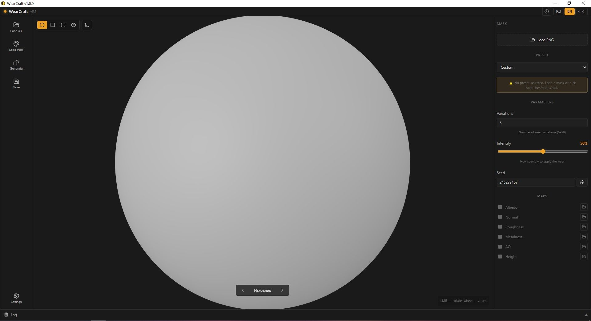
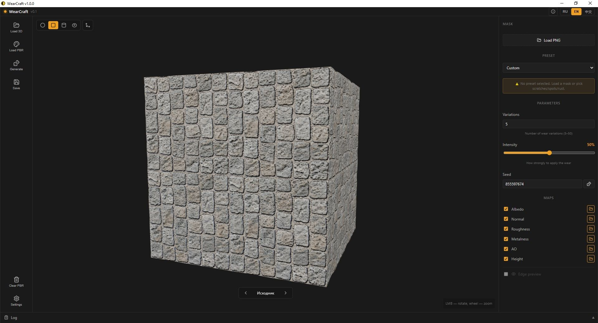
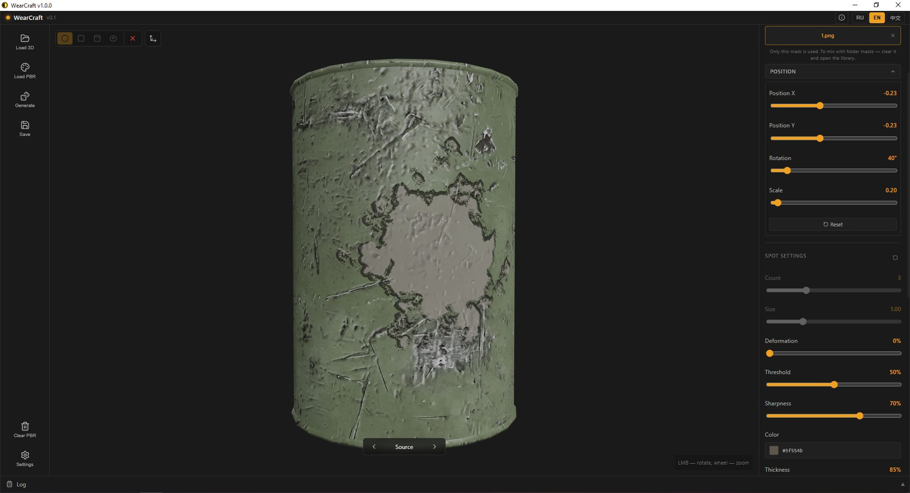

markdown
**Procedural wear generator for PBR textures**

**Languages:** [English](#english) · [Русский](#russian) · [中文](#chinese)

---

## 🇬🇧 English

### What is it

**WearCraft** is a desktop application for procedural wear generation on PBR texture sets. Load a PBR set (albedo, normal, roughness, ao, height, metalness, edge), generate N unique wear variations, and export to game engines.

The built-in 3D viewer shows the result in real time. **The preview fully matches the baked result** — what you see is what you get.

### Features

- **Presets:** Custom mask, procedural scratches, streaks (drips), spots, rust, decal
- **Mask presets** (spots / rust / streaks-mask / scratches-mask): UV-projection with UV-island clipping. One spot, positioned with sliders. Best on models with clean, single-island UV layouts.
- **Procedural streaks:** value_noise + fbm, with optional Triplanar projection (world-space, for loaded 3D models only). Procedural preview matches the baked result.
- **Procedural scratches:** Bezier curve generation in UV-space. No real-time preview — press Generate to see the result.
- **UV Islands:** Mask patterns are clipped to the model's UV layout — no more pattern bleeding outside unwrapped areas. For mask presets only.
- **Geometry Limit:** Apply wear only to top / bottom / sides of a surface (based on normals). Sphere + loaded model only.
- **Decal:** Project any PNG/JPG onto the model like a sticker — position, scale, rotation, opacity, aspect ratio, tiling, height-based bump
- **Masks:** Own mask (single PNG) or library (folder-based, %APPDATA%)
- **Positioning:** Move, rotate, scale each spot. Tiling control per variation
- **Generation:** Parallel (rayon), N variations, each with unique seed
- **3D Preview:** Sphere, cube, cylinder, torus, or your own .obj / .gltf model
- **HDR Environment:** 5 lighting presets (Neutral / Warm / Cool / White / Night) + intensity slider
- **UI Zoom:** Ctrl+= / Ctrl+− / Ctrl+0, steps 75%–200%
- **Engine Export:** Unreal Engine (ORM + DX normal), Unity (MetallicSmoothness, Built-in / URP)
- **i18n:** Russian, English, Chinese

### What's new in 1.2.0

#### Preview accuracy
- **Procedural streaks preview = bake** — fixed floating-point seed precision loss. Seed is now passed to the shader modulo 10000, so the GLSL float32 representation stays exact. Preview now fully matches the generated PNG.
- **Mask orientation fixed** — masks no longer load upside-down. Y-flip is now consistent between the preview shader and the Rust generator.
- **Streaks-mask and scratches-mask**: thickness slider now correctly affects the preview and produces convex (raised) wear instead of inverted (pressed-in).
- **Streaks-mask**: deformation slider now works in the preview.
- **Scratches-mask**: no longer silent. Previously returned an empty pool and showed nothing.

#### Architecture
- **Mask pattern generator split** — the single `mask_pattern` function was replaced with 4 independent functions (`dirt_pattern_masks`, `rust_pattern_masks`, `streaks_mask_pattern`, `scratches_mask_pattern`). Editing one preset no longer breaks the others.
- **Params Panel refactored** — the 1800-line `ParamsPanel.svelte` was split into 12 files. Much easier to maintain and extend.

#### UI
- **Procedural streaks**: new "Triplanar (3D projection)" checkbox. Only shown for loaded 3D models — for primitives UV projection is used (world-space data is not baked).
- **Geometry Limit UI** is hidden for primitives (cube / cylinder / torus) — it was never reliable there due to overlapping UVs. Available for sphere and loaded models.
- **Triplanar checkbox** localized (Russian / English / Chinese).

#### Bug fixes
- Pattern position updates correctly when switching between variations in the preview.
- Mask preview no longer stays on top of generated variations.
- Variation cache is cleared before each new generation.

Full changelog: [Releases](https://github.com/invisiblelevel/WearCraft/releases)

### What was in 1.1.0

- **Decal** — separate mode: project any image (PNG/JPG) onto the model like a sticker. Real-time preview, opacity, affect albedo / roughness / normal, height-based bump.
- **HDR Environment** — 5 presets via Settings → Environment tab. Intensity 0–200%. Optional HDR backdrop.
- **UI Zoom** — Ctrl+= / Ctrl+− / Ctrl+0. Steps 75%–200%.
- **Streaks (procedural)** — value_noise + fbm + vertical stretch.
- **Scratches** — two modes: procedural (Bezier) + mask-based (real-time preview).

### Requirements

- Windows 10 / 11 (x64)
- WebView2 (included in the installer)
- Rust 1.80+ and Node.js 20+ (to build from source)

### Run from source

    git clone https://github.com/invisiblelevel/WearCraft.git
    cd WearCraft
    npm install
    npm run tauri dev

Build release:

    npm run tauri build

### Installer

Download the installer from Releases and run it. Fully offline installation — no internet required.

### Screenshots

### Tech Stack

- **Desktop:** Tauri 2
- **Frontend:** Svelte 5 (runes), Vite
- **3D:** Three.js
- **Backend:** Rust (image, noise, rand, rayon)

### System Requirements

**Minimum:**
- OS: Windows 10 / 11 (64-bit)
- Processor: Quad-core 2.0 GHz (Intel i5 / AMD Ryzen 5 or equivalent)
- Memory: 8 GB RAM
- Graphics: Integrated GPU (Intel UHD 620 / AMD Vega 8) or better
- DirectX: Version 11
- Storage: 2 GB available space

**Recommended:**
- OS: Windows 11 (64-bit)
- Processor: Hexa-core 3.0 GHz (Intel i7 / AMD Ryzen 7 or equivalent)
- Memory: 16 GB RAM
- Graphics: NVIDIA GTX 1650 / AMD RX 5700 or better
- DirectX: Version 12
- Storage: 8 GB SSD

### Known limitations

- **Mask presets and UV seams** — if the target model has multiple UV islands with different scales (e.g. a jerrycan with 6 separate islands), mask patterns will look uneven and cut off at island borders. This is a limitation of UV projection, not of the app. Solutions: (1) re-unwrap the model in a 3D editor for a single uniform UV layout; (2) use procedural streaks with Triplanar enabled (requires a loaded model); (3) use a mask that fits within a single UV island.
- **Procedural scratches** — no real-time preview (Bezier curve generation in GLSL is too expensive). Press Generate to see the result.
- **Geometry Limit** — not available for cube / cylinder / torus (overlapping UVs). Sphere + loaded models only.
- **Triplanar** — only for procedural streaks on loaded 3D models.

### Roadmap

- [x] PBR texture loading
- [x] 3D model viewer (.obj / .gltf)
- [x] Presets: Custom / Scratches / Streaks / Spots / Rust / Decal
- [x] User mask + library masks
- [x] Position / Rotation / Scale for masks
- [x] Parallel generation (rayon)
- [x] Unreal / Unity export
- [x] Preview = baked result
- [x] User manual (HTML, 3 languages)
- [x] HDR environment (5 presets + intensity)
- [x] UI zoom (Ctrl+= / Ctrl+− / Ctrl+0)
- [x] Decal (image projection with height)
- [x] Geometry limit (normals-based restriction)
- [x] UV islands (clipping to model layout for mask presets)
- [x] Triplanar projection for procedural streaks (loaded models only)
- [x] Mask preset generator split (4 independent functions)
- [ ] Triplanar for mask presets (world-space spot projection)
- [ ] GPU compute for generation
- [ ] Light theme
- [ ] Resizable panels

### License

MIT License — free for commercial use.

---

## 🇷🇺 Русский

### Что это

**WearCraft** — десктопное приложение для процедурной генерации износа PBR-текстур. Загружаешь PBR-сет (albedo, normal, roughness, ao, height, metalness, edge), генерируешь N уникальных вариаций износа и экспортируешь в игровые движки.

Встроенный 3D-вьюер показывает результат в реальном времени. **Превью полностью совпадает с запечённым результатом** — что видишь, то и получишь.

### Возможности

- **Пресеты:** Своя маска, процедурные царапины, потёки, пятна, ржавчина, декаль
- **Пресеты с масками** (пятна / ржавчина / потёки-маски / царапины-маски): UV-проекция с обрезкой по UV-островам. Одно пятно, управляется слайдерами. Лучше всего работает на моделях с чистой одноостровной UV-развёрткой.
- **Процедурные потёки:** value_noise + fbm, опционально Triplanar (world-space, только для загруженной 3D-модели). Превью полностью совпадает с запечкой.
- **Процедурные царапины:** Bezier-генерация в UV-пространстве. Real-time превью нет — нажми «Генерировать», чтобы увидеть результат.
- **UV-острова:** Паттерны обрезаются по UV-развёртке модели. Только для пресетов с масками.
- **Ограничение по геометрии:** Наложение износа только на верх / низ / бока поверхности (по нормалям). Только сфера и загруженная модель.
- **Decal (наклейка):** Наложение любой картинки PNG/JPG на модель как стикера — позиция, масштаб, поворот, прозрачность, пропорции, тайлинг, объём от height-карты
- **Маски:** Своя маска (один PNG) или библиотека (папка в %APPDATA%)
- **Позиционирование:** Движение, поворот, масштаб каждого пятна. Управление тайлингом на вариацию
- **Генерация:** Параллельная (rayon), N вариаций, каждая со своим seed
- **3D-превью:** Сфера, куб, цилиндр, тор, или своя .obj / .gltf модель
- **HDR-окружение:** 5 пресетов освещения (Neutral / Warm / Cool / White / Night) + слайдер интенсивности
- **Зум UI:** Ctrl+= / Ctrl+− / Ctrl+0, ступени 75%–200%
- **Экспорт в движки:** Unreal Engine (ORM + DX normal), Unity (MetallicSmoothness, Built-in / URP)
- **i18n:** Русский, английский, китайский

### Что нового в 1.2.0

#### Точность превью
- **Превью процедурных потёков = запечка** — исправлена потеря точности float32 при передаче seed в шейдер. Seed передаётся по модулю 10000, чтобы GLSL-представление оставалось точным. Превью теперь полностью совпадает с PNG.
- **Ориентация масок исправлена** — маски больше не грузятся вверх ногами. Y-flip синхронизирован между шейдером превью и генератором Rust.
- **Потёки-маски и царапины-маски**: слайдер толщины теперь корректно влияет на превью и даёт выпуклость (а не вдавливание).
- **Потёки-маски**: слайдер деформации теперь работает в превью.
- **Царапины-маски**: больше не молчат. Раньше возвращали пустой пул и ничего не показывали.

#### Архитектура
- **Разделение генератора паттернов** — единая функция `mask_pattern` заменена на 4 независимые (`dirt_pattern_masks`, `rust_pattern_masks`, `streaks_mask_pattern`, `scratches_mask_pattern`). Правка одного пресета больше не ломает остальные.
- **ParamsPanel отрефакторен** — 1800-строчный `ParamsPanel.svelte` разбит на 12 файлов.

#### UI
- **Процедурные потёки**: новый чекбокс «Triplanar (3D-проекция)». Показывается только для загруженных 3D-моделей — для примитивов используется UV-проекция.
- **Geo-limit UI** скрыт для примитивов (куб / цилиндр / торус) — там он никогда не работал надёжно из-за overlapping UV. Доступен для сферы и загруженных моделей.
- **Чекбокс Triplanar** локализован (русский / английский / китайский).

#### Фиксы
- Позиция паттерна корректно обновляется при переключении между вариациями в превью.
- Mask-preview больше не висит поверх сгенерированных вариаций.
- Кэш вариаций очищается перед каждой новой генерацией.

Полный changelog: [Releases](https://github.com/invisiblelevel/WearCraft/releases)

### Что было в 1.1.0

- **Decal** — отдельный режим: наложение любой картинки (PNG/JPG) на модель как стикера.
- **HDR-окружение** — 5 пресетов через Settings → вкладка «Окружение».
- **Зум UI** — Ctrl+= / Ctrl+− / Ctrl+0.
- **Streaks (процедурный)** — value_noise + fbm + вертикальный stretch.
- **Scratches** — два режима: процедурно (Bezier) + через маски (real-time превью).

### Требования

- Windows 10 / 11 (x64)
- WebView2 (входит в установщик)
- Rust 1.80+ и Node.js 20+ (для сборки из исходников)

### Запуск из исходников

    git clone https://github.com/invisiblelevel/WearCraft.git
    cd WearCraft
    npm install
    npm run tauri dev

Сборка релиза:

    npm run tauri build

### Установщик

Скачай установщик из раздела Releases и запусти. Полностью офлайн-установка — интернет не нужен.

### Скриншоты

### Технологии

- **Desktop:** Tauri 2
- **Frontend:** Svelte 5 (runes), Vite
- **3D:** Three.js
- **Backend:** Rust (image, noise, rand, rayon)

### Системные требования

**Минимальные:**
- ОС: Windows 10 / 11 (64-bit)
- Процессор: 4 ядра 2.0 ГГц
- Память: 8 ГБ RAM
- Графика: Встроенная GPU или лучше
- DirectX: 11
- Место: 2 ГБ

**Рекомендуемые:**
- ОС: Windows 11 (64-bit)
- Процессор: 6 ядер 3.0 ГГц
- Память: 16 ГБ RAM
- Графика: NVIDIA GTX 1650 / AMD RX 5700 или лучше
- DirectX: 12
- Место: 8 ГБ SSD

### Известные ограничения

- **Пресеты с масками и UV-швы** — если у модели несколько UV-островов с разным масштабом (например, канистра с 6 островами), паттерны масок будут выглядеть неравномерно и обрезаться по границам островов. Это ограничение UV-проекции, а не приложения. Решения: (1) переразвернуть модель в 3D-редакторе для единой развёртки; (2) использовать процедурные потёки с включённым Triplanar; (3) использовать маску, помещающуюся в один UV-остров.
- **Процедурные царапины** — нет real-time превью. Нажми «Генерировать».
- **Ограничение по геометрии** — недоступно для куба / цилиндра / торуса. Только сфера и загруженные модели.
- **Triplanar** — только для процедурных потёков на загруженных моделях.

### План развития

- [x] Загрузка PBR-текстур
- [x] 3D-вьюер (.obj / .gltf)
- [x] Пресеты: Своя маска / Царапины / Потёки / Пятна / Ржавчина / Decal
- [x] Своя маска + библиотека масок
- [x] Позиция / Поворот / Масштаб для масок
- [x] Параллельная генерация (rayon)
- [x] Экспорт в Unreal / Unity
- [x] Превью = запечённый результат
- [x] Руководство пользователя (HTML, 3 языка)
- [x] HDR-окружение (5 пресетов + интенсивность)
- [x] Зум UI (Ctrl+= / Ctrl+− / Ctrl+0)
- [x] Decal (проекция картинки с объёмом)
- [x] Ограничение по геометрии (по нормалям)
- [x] UV-острова (обрезка для пресетов с масками)
- [x] Triplanar для процедурных потёков (только загруженные модели)
- [x] Разделение генератора масок (4 независимые функции)
- [ ] Triplanar для пресетов с масками (world-space проекция пятна)
- [ ] GPU compute для генерации
- [ ] Светлая тема
- [ ] Ресайз панелей

### Лицензия

MIT License — бесплатно для коммерческого использования.

---

## 🇨🇳 中文

### 这是什么

**WearCraft** 是一款用于 PBR 贴图集程序化磨损生成的桌面应用程序。加载 PBR 集，生成 N 个独特的磨损变体，并导出到游戏引擎。

内置 3D 查看器实时显示结果。**预览与烘焙结果完全一致**——所见即所得。

### 功能

- **预设：** 自定义遮罩、程序化划痕、流痕、斑点、锈蚀、贴花
- **遮罩预设**（斑点 / 锈蚀 / 流痕-遮罩 / 划痕-遮罩）：UV 投影并按 UV 岛屿裁剪。单个斑点，通过滑块控制。在具有干净单一 UV 布局的模型上效果最佳。
- **程序化流痕：** value_noise + fbm，可选 Triplanar 投影（世界空间，仅适用于已加载的 3D 模型）。预览与烘焙结果完全一致。
- **程序化划痕：** 在 UV 空间中生成 Bezier 曲线。无实时预览——按生成按钮查看结果。
- **UV 岛屿：** 图案按模型的 UV 布局进行裁剪——仅适用于遮罩预设。
- **几何限制：** 仅将磨损应用于表面的顶部 / 底部 / 侧面（基于法线）。仅球体和加载的模型。
- **贴花：** 将任意 PNG/JPG 图像像贴纸一样投射到模型上——位置、缩放、旋转、不透明度、宽高比、平铺、基于高度的凹凸
- **遮罩：** 自定义遮罩（单个 PNG）或库（基于文件夹，%APPDATA%）
- **定位：** 移动、旋转、缩放每个斑点。每个变体的平铺控制
- **生成：** 并行（rayon），N 个变体，每个都有唯一的种子
- **3D 预览：** 球体、立方体、圆柱体、圆环，或您自己的 .obj / .gltf 模型
- **HDR 环境：** 5 个光照预设（Neutral / Warm / Cool / White / Night）+ 强度滑块
- **UI 缩放：** Ctrl+= / Ctrl+− / Ctrl+0，步长 75%–200%
- **引擎导出：** Unreal Engine（ORM + DX 法线），Unity（MetallicSmoothness，Built-in / URP）
- **国际化：** 俄语、英语、中文

### 1.2.0 更新内容

#### 预览精度
- **程序化流痕预览 = 烘焙结果** —— 修复了浮点 seed 精度损失。Seed 现在以模 10000 传递到着色器，以保证 GLSL float32 表示的精确性。预览现在与生成的 PNG 完全一致。
- **遮罩方向已修复** —— 遮罩不再上下颠倒加载。Y 翻转在预览着色器和 Rust 生成器之间已同步。
- **流痕-遮罩和划痕-遮罩**：厚度滑块现在能正确影响预览，并产生凸起效果（而非凹陷）。
- **流痕-遮罩**：变形滑块现在在预览中生效。
- **划痕-遮罩**：不再无声。以前返回空池，不显示任何内容。

#### 架构
- **遮罩图案生成器拆分** —— 单一函数 `mask_pattern` 被替换为 4 个独立函数。修改一个预设不再破坏其他预设。
- **参数面板重构** —— 1800 行的 `ParamsPanel.svelte` 拆分为 12 个文件。

#### UI
- **程序化流痕**：新增「Triplanar（3D 投影）」复选框。仅对已加载的 3D 模型显示——对于基本体使用 UV 投影。
- **几何限制 UI** 对基本体（立方体 / 圆柱体 / 圆环）隐藏。仅球体和加载的模型可用。
- **Triplanar 复选框** 已本地化（俄语 / 英语 / 中文）。

#### 修复
- 在预览中切换变体时，图案位置现在正确更新。
- 遮罩预览不再停留在生成的变体之上。
- 每次新生成前清空变体缓存。

完整更新日志：[Releases](https://github.com/invisiblelevel/WearCraft/releases)

### 1.1.0 更新内容

- **贴花** — 独立模式：将任意图像（PNG/JPG）像贴纸一样投射到模型上。
- **HDR 环境** — 通过 Settings → 环境标签页访问 5 个预设。
- **UI 缩放** — Ctrl+= / Ctrl+− / Ctrl+0。
- **流痕（程序化）** — value_noise + fbm + 垂直拉伸。
- **划痕** — 两种模式：程序化（Bezier）+ 基于遮罩（实时预览）。

### 系统要求

- Windows 10 / 11（x64）
- WebView2（安装程序中包含）
- Rust 1.80+ 和 Node.js 20+（从源代码构建）

### 从源代码运行

    git clone https://github.com/invisiblelevel/WearCraft.git
    cd WearCraft
    npm install
    npm run tauri dev

构建发布版：

    npm run tauri build

### 安装程序

从 Releases 下载安装程序并运行。完全离线安装——无需互联网。

### 截图

### 技术栈

- **桌面：** Tauri 2
- **前端：** Svelte 5（runes）、Vite
- **3D：** Three.js
- **后端：** Rust（image、noise、rand、rayon）

### 系统配置

**最低配置：**
- 操作系统：Windows 10 / 11（64 位）
- 处理器：四核 2.0 GHz
- 内存：8 GB RAM
- 显卡：集成显卡或更好
- DirectX：版本 11
- 存储：2 GB 可用空间

**推荐配置：**
- 操作系统：Windows 11（64 位）
- 处理器：六核 3.0 GHz
- 内存：16 GB RAM
- 显卡：NVIDIA GTX 1650 / AMD RX 5700 或更好
- DirectX：版本 12
- 存储：8 GB SSD

### 已知限制

- **遮罩预设与 UV 接缝** —— 如果目标模型有多个不同比例的 UV 岛屿（例如有 6 个独立岛屿的罐子），遮罩图案会显得不均匀并在岛屿边界处被切断。这是 UV 投影的限制，不是应用程序的问题。解决方案：(1) 在 3D 编辑器中重新展开模型以获得单一 UV 布局；(2) 使用启用 Triplanar 的程序化流痕；(3) 使用能放入单个 UV 岛屿的遮罩。
- **程序化划痕** —— 无实时预览。按生成按钮查看结果。
- **几何限制** —— 不适用于立方体 / 圆柱体 / 圆环。仅球体和加载的模型。
- **Triplanar** —— 仅用于已加载模型上的程序化流痕。

### 路线图

- [x] PBR 贴图加载
- [x] 3D 模型查看器（.obj / .gltf）
- [x] 预设：自定义 / 划痕 / 流痕 / 斑点 / 锈蚀 / 贴花
- [x] 自定义遮罩 + 遮罩库
- [x] 遮罩的位置 / 旋转 / 缩放
- [x] 并行生成（rayon）
- [x] Unreal / Unity 导出
- [x] 预览 = 烘焙结果
- [x] 用户手册（HTML，3 种语言）
- [x] HDR 环境（5 个预设 + 强度）
- [x] UI 缩放（Ctrl+= / Ctrl+− / Ctrl+0）
- [x] 贴花（带高度的图像投射）
- [x] 几何限制（基于法线）
- [x] UV 岛屿（遮罩预设的裁剪）
- [x] 程序化流痕的 Triplanar（仅限已加载模型）
- [x] 遮罩生成器拆分（4 个独立函数）
- [ ] 遮罩预设的 Triplanar（世界空间斑点投影）
- [ ] 用于生成的 GPU 计算
- [ ] 浅色主题
- [ ] 可调整大小的面板

### 许可证

MIT 许可证——可免费用于商业用途。

---

**Author:** INV.LVL
**Version:** 1.2.0
**Date:** 2026